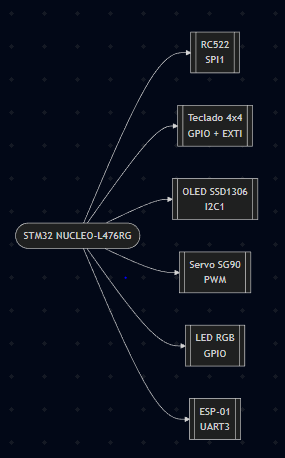
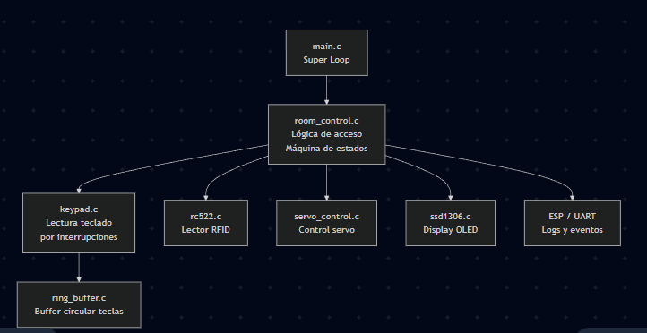
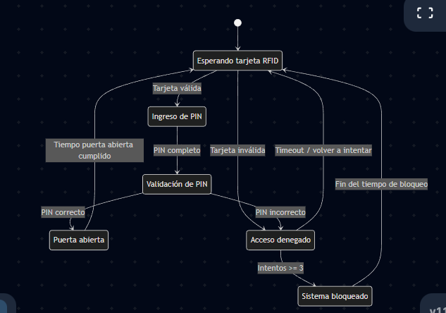
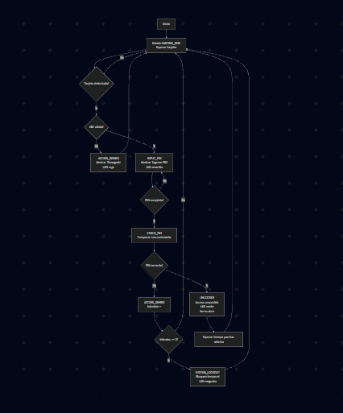
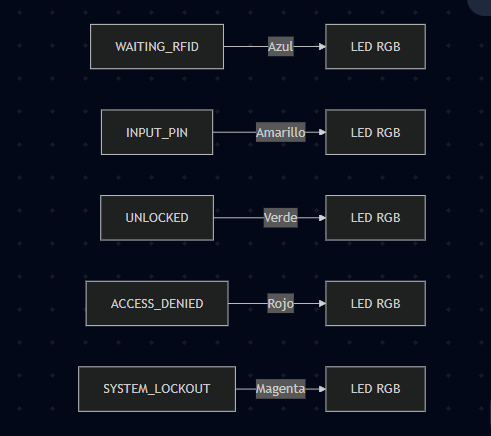

# Proyecto Final: Sistema de Control de Acceso Remoto con RFID + PIN + Servo

**Curso:** Estructuras Computacionales (4100901)  
**Universidad Nacional de Colombia - Sede Manizales**  
**Integrantes:** Maria Jose Cuadros y Juan David Romero

---

## 1. Resumen del proyecto

El proyecto implementa un **Sistema de Control de Acceso Remoto** utilizando la placa **NUCLEO‑L476RG**, combinando autenticación por **tarjeta RFID** y **PIN por teclado matricial**, control físico mediante **servo como cerradura**, **interfaz visual OLED + LED RGB** y **conectividad remota vía ESP‑01**.

Este sistema integra los conceptos vistos en el semestre:

- Uso de la capa HAL y periféricos (GPIO, SPI, I2C, UART, TIM).
- Creación de **drivers modulares** para los distintos dispositivos (RFID, teclado, servo, OLED, LED RGB, ring buffer).
- Gestión de **interrupciones** (teclado, UART).
- Arquitectura basada en **Super Loop no bloqueante** y **Máquina de Estados explícita**.
- Implementación de un **parser de comandos** para control remoto vía TCP/IP.

A diferencia del planteamiento original del proyecto genérico (control de climatización), en esta implementación el **sensor de temperatura y el ventilador** se reemplazan por:

- **RFID RC522** como sensor de presencia/identidad de tarjeta.
- **Servo SG90** como actuador de apertura/cierre de cerradura.

El objetivo no es solo construir un sistema funcional, sino también documentar de forma clara la **arquitectura de hardware y firmware**, y mostrar cómo se aplican patrones de diseño en sistemas embebidos.

---

## 2. Descripción funcional

### 2.1 Control de acceso RFID + PIN

- El sistema requiere **dos factores de autenticación**:
  - **Tarjeta RFID válida** (UID autorizado).
  - **PIN de 4 dígitos** ingresado en un **teclado matricial 4x4**.
- Flujo básico:
  1. El usuario acerca una tarjeta RFID al lector RC522.
  2. El sistema lee el UID y verifica si está en la lista de tarjetas autorizadas.
  3. Si la tarjeta es válida, el sistema pide un PIN de 4 dígitos.
  4. Si el PIN es correcto:
     - El **servo** se mueve a posición de “ABIERTO”.
     - La pantalla OLED muestra “Acceso concedido”.
     - El **LED RGB** se pone en **verde**.
  5. Si el PIN es incorrecto:
     - La OLED muestra “PIN incorrecto” / “Acceso denegado”.
     - El LED RGB se pone en **rojo**.
     - Se incrementa el contador de intentos fallidos.
- En caso de múltiples intentos fallidos, el sistema entra en un estado de **bloqueo temporal (SYSTEM_LOCKOUT)**.

---

### 2.2 Interfaz de usuario (Display OLED + LED RGB)

- La pantalla **OLED SSD1306** es la **interfaz visual principal**:
  - Muestra estados como:
    - “Esperando tarjeta”
    - “Tarjeta OK”
    - “Ingrese PIN”
    - “Acceso concedido”
    - “Acceso denegado”
    - “Sistema bloqueado”
  - Enmascara la entrada de la clave (ej. `****`).
  - Muestra mensajes de eventos remotos (ej. “REMOTE: OPEN”).
- El **LED RGB** actúa como indicador rápido de estado:
  - **Azul:** Sistema esperando tarjeta.
  - **Verde:** Acceso concedido / puerta abierta.
  - **Rojo:** Error de tarjeta o PIN incorrecto.
  - **Rojo parpadeando:** Sistema bloqueado (lockout).

---

### 2.3 Control físico mediante servo (cerradura)

- El **Servo SG90** reemplaza al ventilador DC del planteamiento original.
- Funcionamiento:
  - El servo se controla mediante un **canal PWM** de un Timer.
  - Se definen al menos dos posiciones:
    - **CERRADO** (ej. 0°).
    - **ABIERTO** (ej. 90°).
  - El firmware:
    - Mueve el servo a “ABIERTO” al conceder acceso (estado UNLOCKED).
    - Mantiene la puerta abierta un tiempo `T`.
    - Regresa a “CERRADO” y vuelve al estado WAITING_RFID.

---

### 2.4 Conectividad y control remoto

Se integra un módulo **ESP‑01** con firmware **`esp-link`** que actúa como puente **UART ↔ WiFi**.

El sistema puede ser controlado y monitoreado mediante:

1. **Consola de Depuración Local (USART2)**  
   - Conectada al PC vía ST‑Link (Virtual COM Port).
   - Permite ver logs del sistema (`[STM32][LOG] ...`).

2. **Consola Remota (USART3 + ESP‑01)**  
   - Accesible vía TCP/IP (ej. `netcat`, PuTTY).
   - Permite enviar comandos de texto y recibir respuestas.

El firmware implementa un **parser de comandos** sobre un **ring buffer** (ver `Drivers/ring_buffer/ring_buffer.c`) para interpretar órdenes sencillas del tipo:

- `GET_STATUS`  
  Devuelve el estado del sistema, por ejemplo:
  - `STATUS: 0` → Cerrado / esperando tarjeta.
  - `STATUS: 1` → Puerta abierta.
  - `STATUS: LOCKOUT` → Sistema bloqueado.

- `FORCE_OPEN:1`  
  Fuerza la apertura remota de la puerta:
  - Mueve el servo a “ABIERTO”.
  - Muestra “REMOTE: OPEN” en la OLED.
  - LED RGB en verde.
  - Respeta el tiempo de apertura y luego cierra.

> Nota: En esta implementación el foco está en el control de acceso; comandos como `GET_TEMP`, `FORCE_FAN` del enunciado original se adaptan conceptualmente a consulta de estado y control del servo/cerradura.

---

## 3. Arquitectura del sistema

### 3.1 Arquitectura de hardware (HW)

Diagrama de bloques de hardware del sistema de control de acceso:

### 3.1.1 Descripción de Componentes

| Componente                | Función                | Interfaz    |
| ------------------------- | ---------------------- | ----------- |
| **RC522 RFID**            | lectura de UID         | SPI2        |
| **Teclado matricial 4×4** | ingreso del PIN        | GPIO + EXTI |
| **OLED SSD1306**          | interfaz gráfica       | I2C1        |
| **Servo SG90**            | cerradura electrónica  | PWM (TIM3)  |
| **ESP-01**                | transmisión de eventos | UART2       |
| **LED RGB**               | indicador del estado   | GPIO        |

### 3.2 Arquitectura de Firmware
### 3.2.1 Diagrama de Bloques del Firmware

### 3.2.2 Patrón de Diseño: Super Loop No Bloqueante

Tu main.c sigue exactamente el patrón recomendado:

    while (1) {
      heartbeat();                           // LED de vida
            room_control_update(&room_system);     // lógica principal
            if (ring_buffer_read(&keypad_rb,&key)) {
                room_control_process_key(&room_system, key);
            }
            HAL_Delay(10);
        }

-  No bloquea la ejecución
-  Llama funciones por evento
-  Es ideal para sistemas embebidos reactivos

### 3.2.3 Máquina de Estados (Definida en room_control.c)

## 4. Descripción Funcional del Sistema

### 4.1 Control de Acceso RFID

  En process_rfid_check():

    if (MFRC522_Compare(str, VALID_CARD_UID) == MI_OK) {
    room_control_change_state(room, ROOM_STATE_INPUT_PIN);
    } 
    else {
        room_control_change_state(room, ROOM_STATE_ACCESS_DENIED);
    }

-  Detecta tarjetas
-  Lee UID
-  Compara con la tarjeta autorizada
-  Cambia el estado según el resultado

### 4.2 Control de Acceso por PIN

En room_control_process_key():

      room->input_buffer[room->input_index++] = key;

    if (room->input_index == PASSWORD_LENGTH)
        room_control_change_state(room, ROOM_STATE_CHECK_PIN);

  -  Lee teclas desde el ring buffer
  -  Enmascara entrada en OLED
  -  Cuando se ingresa el PIN completo → se valida

### 4.3 Validación del PIN
      if (strcmp(room->input_buffer, room->stored_password) == 0)
      room_control_change_state(room, ROOM_STATE_UNLOCKED);
      else {
    room->failed_attempts++;
    ...
    }

-  PIN incorrecto → estado ACCESS_DENIED
-  3 errores → estado SYSTEM_LOCKOUT
### 4.4 Control del Servo (Cerradura)     
      if (open)
    servo_move_slow(&door_servo, 90, 20);
    else
        servo_move_slow(&door_servo, 0, 20);

    if (open)
        servo_move_slow(&door_servo, 90, 20);
    else
        servo_move_slow(&door_servo, 0, 20);
-  Movimiento suave
-  90° = puerta abierta
-  0° = cerrada
-  Se cierra automáticamente tras 5 segundos
### 4.5 Interfaz OLED

  Según el estado:
  "BIENVENIDO / Pase Tarjeta"
  "PIN: ****"
  "ACCESO CONCEDIDO"
  "DENEGADO"
  "BLOQUEADO"

### 4.6 Envío de Eventos por ESP-01
      sprintf(buffer, "{ evento: %s, uid: %s, clave: %s }\r\n");
      HAL_UART_Transmit(&huart2, buffer, strlen(buffer), 50);
-  Logs de acceso
-  UID detectado
-  PIN ingresado
-  Estados críticos como lockout

## 5. Protocolo de Comandos (extensible)

Aunque tu versión no usa control remoto completo, el sistema soporta:
| Comando         | Función           |
| --------------- | ----------------- |
| `UNLOCK`        | Fuerza apertura   |
| `GET_STATUS`    | Devuelve estado   |
| `SET_PASS:XXXX` | Cambia PIN        |
| `PING`          | Verifica conexión |

## 6. Optimización Aplicada

- Uso de interrupciones → teclas capturadas sin perder ninguna
- Ring buffer → lectura no bloqueante
- Máquina de estados → simplifica flujo
- Servo con movimiento lento → evita daños mecánicos
- OLED actualizado solo cuando se requiere
- UART por interrupciones

## 7. Estados y colores del LED RGB

## 8. Resultados
| Función        | Resultado                     |
| -------------- | ----------------------------- |
| Lectura RFID   | Precisa y rápida              |
| Validación PIN | Inmediata                     |
| Servo          | Movimiento suave y controlado |
| OLED           | Mensajes claros por estado    |
| Lockout        | Funciona según intentos       |
| Eventos UART   | Reportes correctos            |

## 9. Conclusiones

- Se logró un sistema de doble seguridad funcional (RFID + PIN).
- El servo simula una cerradura electrónica de manera efectiva.
- La máquina de estados hace que el sistema sea estable y predecible.
- La arquitectura modular facilita mantenimiento y futuras expansiones.
- Se integra hardware, firmware y comunicación serial de forma profesional.

## 10. Trabajo Futuro

- Soporte para múltiples tarjetas autorizadas
- Registro histórico de accesos
- Control remoto vía WiFi (panel web)
- Doble servo o cierre electromagnético real
- Encriptación en comunicación serial
- 
**LINK DEL VIDEO**: 
- https://youtube.com/shorts/WY6WjbrOvyY?si=ND8Kyd7fTQtL6ao_ 
- https://youtu.be/fEQ7JHRJ43k?si=NJzo5l4ifUAB707y